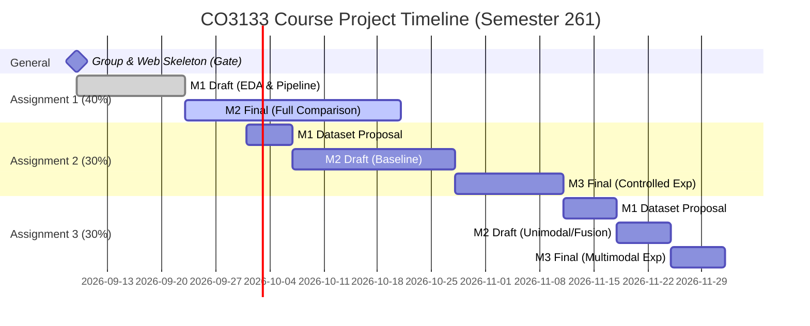

# CO3133: Deep Learning and Its Applications — Course Project Portfolio

<div align="center">


-informational?style=for-the-badge)


**Official Course Project Landing Page & Technical Portfolio**  
*Faculty of Computer Science and Engineering — Ho Chi Minh City University of Technology (HCMUT)*

[Course Handbook](handbook-ene.pdf) • [Live Showcase (GitHub Pages)](https://nguyendangcole.github.io/deeplearning-assignment/) • [Source Repository](https://github.com/nguyendangcole/deeplearning-assignment)

</div>

---

## 📌 1. General Information

| Field | Detail |
| :--- | :--- |
| **Institution** | Ho Chi Minh City University of Technology (HCMUT), VNU-HCM |
| **Faculty** | Faculty of Computer Science and Engineering (CSE) |
| **Course** | Deep Learning and Its Applications (`CO3133`) |
| **Academic Year** | Semester 261 (2026 – 2027) |
| **Instructor** | Dr. Lê Thành Sách |
| **Student** | **Đặng Duy Nguyên** (Student ID: `2352821`) |
| **Program** | Undergraduate Student |
| **Code Repository**| [nguyendangcole/deeplearning-assignment](https://github.com/nguyendangcole/deeplearning-assignment) |

---

## 🎯 2. Project Overview

This repository hosts the **official web landing page and technical portfolio** for the course *CO3133: Deep Learning and Its Applications*. 

As specified in the **Course Project Handbook (Section 2.1)**, every registered group/student maintains a centralized public website on GitHub Pages serving as the single source of truth for:
- Coursework navigation and assignment specifications.
- Technical pipeline documentation and methodology breakdowns.
- Presentation video embeds and downloadable academic reports/slides.
- Transparent **AI Usage Disclosures** in compliance with university academic integrity guidelines.

> **Note on Implementation Status:**  
> The assignments are scheduled across the semester according to the course roadmap. The landing page currently serves as the **introductory milestone and project skeleton (Week 3 Gate)**. Implementation details, experimental results, checkpoints, and presentation videos will be updated as each assignment milestone is reached.

---

## 🗓️ 3. Course Project Structure & Milestones

The course project consists of **three core assignments** contributing to 100% of the course project grade (BTL):



### Summary of Assignments

| Assignment | Topic & Scope | Primary Dataset | Key Models & Methods | Weight |
| :--- | :--- | :--- | :--- | :---: |
| **Assignment 1** | **Foundations of Deep Learning Pipelines & Architectures**<br>Comparative study from linear models to sequence models for image classification. | Fashion-MNIST<br>*(Debug: MNIST, Ext: CIFAR-10)* | • Linear / Softmax Classifier<br>• Multilayer Perceptron (MLP)<br>• Convolutional Neural Network (CNN)<br>• Recurrent Network (LSTM/GRU)<br>• Vision Transformer (ViT) | **40%** |
| **Assignment 2** | **Deep Learning on Large-Scale Data & Specialized Tasks**<br>End-to-end specialized CV or NLP pipeline with pretrained backbones. | Domain-specific dataset (≥ 5,000 samples, approved proposal) | • Simple Baseline<br>• Modern Pretrained Backbone (Transfer Learning)<br>• Fine-tuning protocol & Controlled Ablation | **30%** |
| **Assignment 3** | **Multimodal Deep Learning**<br>Cross-modal representation, fusion strategies, and alignment. | Paired multimodal dataset (e.g., Image-Text, VQA, RGB-Depth) | • Unimodal Baselines (Modality A & B)<br>• Simple Fusion Baseline<br>• Advanced Multimodal Fusion Architecture | **30%** |

### Milestone Calendar Overview

| Deadline (23:59 GMT+7) | Milestone | Description |
| :--- | :--- | :--- |
| **09 Sep 2026** | **Course Gate** | **Group Registration + GitHub Pages Skeleton** *(Current)* |
| **23 Sep 2026** | **A1 - M1 Draft** | EDA, Dataset/DataLoader, PyTorch training loop, Linear + MLP runnable |
| **07 Oct 2026** | **A2 - M1 Proposal**| Dataset proposal for specialized task (data, task, split, baseline plan) |
| **21 Oct 2026** | **A1 - M2 Final** | Full 5-model comparative benchmark, error analysis, report, video |
| **28 Oct 2026** | **A2 - M2 Draft** | Simple baseline & preliminary pretrained model metrics |
| **11 Nov 2026** | **A2 - M3 Final** | Full controlled experiments, error analysis, report, video |
| **18 Nov 2026** | **A3 - M1 Proposal**| Multimodal task & paired dataset proposal |
| **25 Nov 2026** | **A3 - M2 Draft** | Unimodal baselines & initial fusion pipeline |
| **02 Dec 2026** | **A3 - M3 Final** | Full cross-modal evaluation, ablation study, report, video |

---

## 🛡️ 4. Academic Integrity & AI-Use Policy

In adherence to **Section 5 of the Course Project Handbook**:
- Generative AI tools (e.g., Google Gemini, Claude, GitHub Copilot) are utilized strictly as **assistive tools** for ideation, boilerplate code scaffolding, UI layout design, and grammar checking.
- All deep learning architectures, experimental designs, mathematical formulations, training runs, evaluation metrics, and analytical conclusions are verified by the student.
- All AI assistance is transparently logged in the application's **AI Usage Disclosure Modal** and documented in the repository.

---

## 💻 5. Landing Page Tech Stack & UI Features

The landing page web application is built with modern web technologies:

- **Core Framework:** React 19 + TypeScript
- **Bundler & Tooling:** Vite 6
- **Styling:** Tailwind CSS + Custom Dark Academic Design System
- **Animations:** Motion (Framer Motion)
- **Icons:** Lucide React
- **Key Features:**
  - 🎓 **Institutional Header & Author Profile:** Verified student and faculty metadata.
  - 📑 **Assignment Specification Modals:** Interactive dialogs showing scope, architectures, datasets, and deliverables.
  - 🎥 **Video Presentation Center:** Responsive modal player with custom timeline controls for required YouTube defense recordings.
  - 🤖 **AI Disclosure Viewer:** Categorized disclosure logs with prompt summaries and verification evidence.
  - ⚡ **Full Responsiveness:** Optimized for desktops, tablets, and mobile devices.

---

## 🚀 6. Local Development Setup

To run this landing page locally on your machine:

### Prerequisites
- [Node.js](https://nodejs.org/) (version 18.0 or higher recommended)
- `npm` or `yarn` / `pnpm`

### Installation Steps

1. **Clone the repository:**
   ```bash
   git clone https://github.com/nguyendangcole/deeplearning-assignment.git
   cd deeplearning-assignment
   ```

2. **Install dependencies:**
   ```bash
   npm install
   ```

3. **Start the local development server:**
   ```bash
   npm run dev
   ```
   Open your browser and navigate to `http://localhost:3000`.

4. **Build for production:**
   ```bash
   npm run build
   ```
   The production-ready static bundle will be generated in the `dist/` directory, ready to deploy to GitHub Pages.

---

## 📂 7. Project Directory Structure

```text
deep-learning-&-applications---co3133/
├── public/                 # Static assets & icons
├── src/
│   ├── components/         # Reusable React UI components
│   │   ├── Navbar.tsx             # Header navigation & quick links
│   │   ├── HeroSection.tsx        # Course overview, intro stats & badges
│   │   ├── AssignmentsSection.tsx # Assignment roadmap cards (A1, A2, A3)
│   │   ├── AssignmentModals.tsx   # Detailed specification dialogs
│   │   ├── VideosSection.tsx      # Video defense showcase
│   │   ├── VideoPlayerModal.tsx   # Video playback modal
│   │   ├── AiUsageSection.tsx     # AI disclosure summary card
│   │   ├── AiUsageModal.tsx       # Detailed AI disclosure log viewer
│   │   ├── AuthorProfileModal.tsx # Student biography & contact modal
│   │   └── Footer.tsx             # Institutional footer
│   ├── data.ts             # Course metadata, milestones & assignment specs
│   ├── types.ts            # TypeScript type definitions
│   ├── App.tsx             # Main application layout & modal controller
│   ├── main.tsx            # React application entrypoint
│   └── index.css           # Tailwind CSS directives & custom themes
├── handbook-ene.pdf        # Official Course Project Handbook (PDF)
├── index.html              # HTML5 template entrypoint
├── package.json            # Project dependencies and npm scripts
├── tsconfig.json           # TypeScript configuration
├── vite.config.ts          # Vite build & plugin configuration
└── README.md               # Project documentation (this file)
```

---

## 📬 8. Contact & References

- **Student:** Đặng Duy Nguyên
- **Email:** `nguyenduydang225@gmail.com`
- **GitHub:** [@nguyenduy-dang](https://github.com/nguyenduy-dang) / [@nguyendangcole](https://github.com/nguyendangcole)
- **Course LMS:** [HCMUT LMS - CO3133](https://lms.hcmut.edu.vn/course/view.php?id=142848)
- **Course Handbook:** Refer to [handbook-ene.pdf](file:///Users/nguyencolece/Desktop/deep-learning-&-applications---co3133/handbook-ene.pdf) in this repository for detailed course guidelines.

<div align="center">
  <sub>Ho Chi Minh City University of Technology (HCMUT) · Semester 261 (2026–2027)</sub>
</div>
